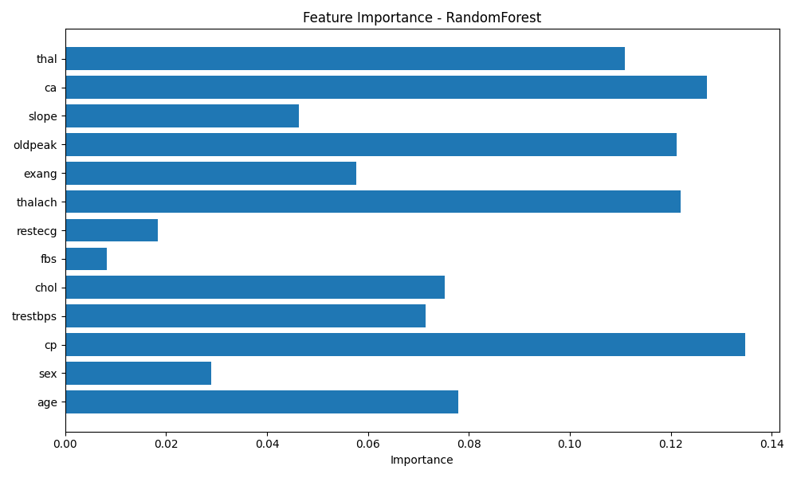

# Heart Disease Prediction – ML Pipeline

## Project Overview

This project implements a structured machine learning pipeline to predict heart disease using a RandomForest classifier.

The goal was to build a modular and reproducible ML workflow with a clean project architecture.

---

## Project Structure
heart_ml_project/
│
├── data/ → raw dataset
├── models/ → trained model and artifacts
├── src/ → modular pipeline scripts
├── notebooks/ → experimentation
├── requirements.txt → dependencies
└── README.md → documentation

---

## Pipeline Steps

1. Data loading  
2. Feature / target separation  
3. Train / test split  
4. Model training  
5. Cross-validation  
6. Model evaluation  
7. Feature importance visualization  
8. Model persistence (joblib)

---

## Model

RandomForestClassifier – scikit-learn

---

## Evaluation Metrics

- Accuracy  
- Cross-validation accuracy  
- Confusion matrix  
- Precision / Recall / F1-score  

---

## Results

RandomForest accuracy: **98.5%**

Confusion Matrix:
[[102 0]
[ 3 100]]

---

## Feature Importance

---

## How to Run

Install dependencies:
pip install -r requirements.txt

Run the full pipeline:
python -m src.run
